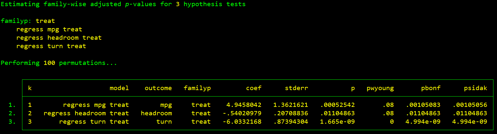
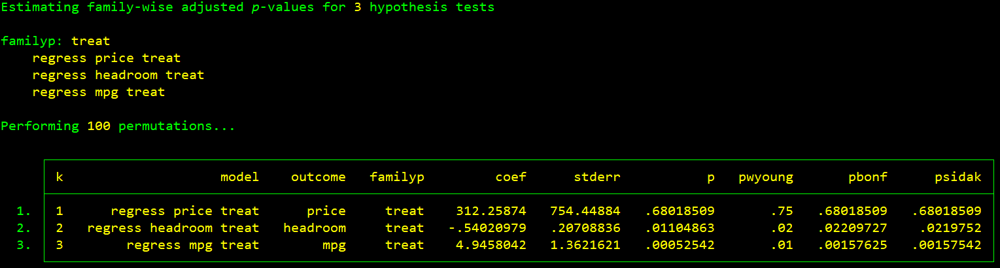

# WYOUNG: control the family-wise error rate when performing multiple hypothesis tests

- Current version: `2.0 3dec2024`
- Jump to: [`overview`](#overview) [`installation`](#installation) [`examples`](#examples) [`update history`](#update-history) [`citation`](#citation) 

-----------

## Overview

`wyoung` is a Stata command that controls the family-wise error rate using the free step-down resampling methodology of Westfall and Young (1993). This method leverages resampling techniques, such as bootstrapping (sampling with replacement) or permutation (shuffling), to adjust the standard *p*-values obtained from model estimation. The command also computes the Bonferroni-Holm and Sidak-Holm adjusted *p*-values. Detailed documentation, including simulation results, is available [here](/documentation/wyoung.pdf). Syntax and usage instructions can be accessed directly in Stata by typing `help wyoung` at the command prompt.

This command was developed as part of the [Illinois Workplace Wellness Study](https://www.nber.org/workplacewellness/).

## Installation

Type `which wyoung` at the Stata prompt to determine your current version number. To install the most recent version, copy and paste the following line of code:

```stata
net install wyoung, from("https://raw.githubusercontent.com/reifjulian/wyoung/master") replace
```

To install the latest version that was uploaded to SSC, copy and paste the following line of code:
```stata
ssc install wyoung, replace
```

After installing, type `help wyoung` to learn the syntax.

## Examples

**Example 1.** Estimate a model separately for three outcomes (`mpg`, `headroom`, and `turn`) and calculated adjusted *p*-value for `displacement` (3 hypotheses).
```stata
sysuse auto.dta, clear
set seed 20
wyoung mpg headroom turn, cmd(regress OUTCOMEVAR displacement length) familyp(displacement) reps(100)
```

For each regression, the output provides both unadjusted and adjusted *p*-values for testing the null hypothesis that the coefficient on the variable `displacement` equals 0. For example, in the regression `regress turn displacment length`, the unadjusted *p*-value is 0.09, while the Westfall-Young adjusted *p*-value is 0.14. The `reps(100)` option specifies 100 bootstrap replications, which is the default setting and is omitted in the examples below for simplicity.

**Example 2.** Estimate a model separately for three outcomes and for two subgroups defined by `foreign` (3 X 2 = 6 hypotheses).
```stata
sysuse auto.dta, clear
set seed 20
local yvars "mpg headroom turn"
wyoung `yvars', cmd(reg OUTCOMEVAR displacement length) familyp(displacement) subgroup(foreign)
```


**Example 3.** Estimate a model for three outcomes, for two subgroups defined by `foreign`, and calculate adjusted *p*-values for both `displacement` and `length` (3 X 2 X 2 = 12 hypotheses).
```stata
sysuse auto.dta, clear
set seed 20
local yvars "mpg headroom turn"
wyoung `yvars', cmd(reg OUTCOMEVAR displacement length) familyp(displacement length) subgroup(foreign)
```


**Example 4.** Estimate a model for three outcomes and test the linear restriction `_b[length] + 50*_b[displacement] = 0` (3 hypotheses).

```stata
sysuse auto.dta, clear
set seed 20
local yvars "mpg headroom turn"
wyoung `yvars', cmd(reg OUTCOMEVAR displacement length) familyp(length+50*displacement) familypexp
```


### Permutation

By default, `wyoung` uses bootstrapping to resample the data. Alternatively, users can specify the `permute()` option to perform permutation-based resampling. As with bootstrapping, permutations can be combined with the `strata()` and `cluster()` options to account for stratified or clustered assignments (see Example 5 below). For more complex treatment assignment schemes, users can define a custom program to handle the assignment process via the `permuteprogram()` option (see Example 6).

**Example 5.** Perform the Westfall-Young adjustment using permutation with a stratified random sample (3 hypotheses).

```stata
sysuse auto.dta, clear
set seed 20
gen stratum = floor(mpg/11)
gen treat = foreign
local yvars "mpg headroom turn"
wyoung `yvars', cmd(regress OUTCOMEVAR treat) familyp(treat) permute(treat) strata(stratum)
```


**Example 6.** Perform the Westfall-Young adjustment using permutation with a customized assignment program (3 hypotheses).

```stata
program define myshuffle
	syntax varname [, *]
	tempvar n_init randsort shuffled 

	gen long `n_init' = _n
	gen double `randsort' = uniform()
	sort `randsort', stable
	gen `shuffled' = `varlist'[`n_init']

	drop `varlist'
	ren `shuffled' `varlist'
end

sysuse auto, clear
set seed 20 
gen treat = foreign
local yvars "price headroom mpg"
wyoung `yvars', cmd(regress OUTCOMEVAR treat) familyp(treat) permute(treat) permuteprogram(myshuffle)
```


## Update History
* **2.0**
  - added `permute()` option. renamed `bootstraps()` option to `reps()` and set default to 100. fixed factor variables bug

* **1.3.3**
  - fixed bug where unadjusted p-val was reported assuming normality (affected Stata versions 14 and lower only)
  
* **1.3.2**
  - better error handling added for `detail` option

* **1.3.1**
  - `controls()` option edited; previous functionality moved to `controlsinteract()`

* **1.3**
  - `controls()` option added

* **1.2**
  - `familyp()` option now supports multiple variables. `subgroup()` option added

* **1.1**
  - `familyp()` option now supports the testing of linear and nonlinear combinations of parameters

* **1.0.5**
  - `familyp()` option now supports factor variables and time-series operators

* **1.0.4**
  - Added support for commands that don't store p-values in `r(table)` (eg `ivreg2`)

* **1.0.3**
  - Better error handling for missing observations
  
* **1.0.2**
  - Cluster bootstrap now required when clustered standard errors are present; force option added

* **1.0.1**
  - Cluster bootstrap option added

## Citation

`wyoung` is not an official Stata command. It is a free contribution to the research community. You may cite it as:

Jones, D., D. Molitor, and J. Reif. "What Do Workplace Wellness Programs Do? Evidence from the Illinois Workplace Wellness Study." *Quarterly Journal of Economics*, November 2019, 134(4): 1747-1791.

