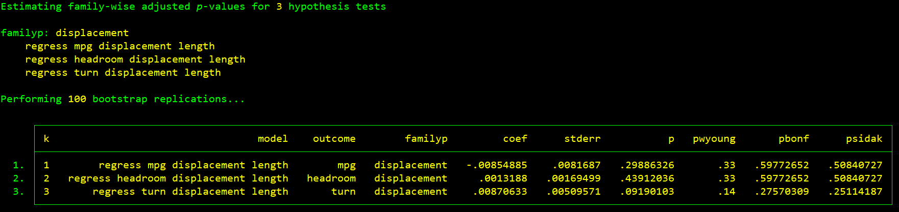
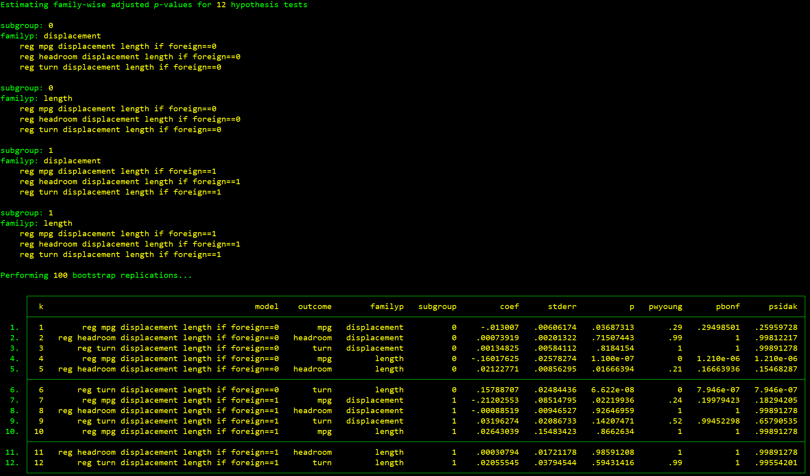

# WYOUNG: control the family-wise error rate when performing multiple hypothesis tests

- Current version: `1.3 20oct2020`
- Jump to: [`overview`](#overview) [`installation`](#installation) [`examples`](#examples) [`update history`](#update-history) [`citation`](#citation) 

-----------

## Overview: 

`wyoung` is a [Stata](http://www.stata.com) command that calculates adjusted *p*-values using the free step-down resampling methodology of Westfall and Young (1993). It also computes the Bonferroni-Holm and Sidak-Holm adjusted *p*-values. Algorithm details and simulation test results are documented [here](/documentation/wyoung.pdf).

This command was developed as part of the [Illinois Workplace Wellness Study](https://www.nber.org/workplacewellness/).

## Installation:

Type `which wyoung` at the Stata prompt to determine your `wyoung` version. To install the most recent version, copy and paste the following line of code:

```stata
net install wyoung, from("https://raw.githubusercontent.com/reifjulian/wyoung/master") replace
```

To install the version that was uploaded to SSC, copy/paste the following line of code:
```stata
ssc install wyoung, replace
```

After installing, type `help wyoung` to learn the syntax.

## Examples
*Example 1.* Estimate a model separately for three outcomes (`mpg`, `headroom`, and `turn`) and calculated adjusted *p*-value for `displacement` (3 hypotheses).
```stata
sysuse auto.dta, clear
set seed 20
wyoung mpg headroom turn, cmd(regress OUTCOMEVAR displacement length) familyp(displacement) bootstraps(100)
```

For each regression, the output reports unadjusted and adjusted *p*-values for the null hypothesis that the coefficient on the variable `displacement` is equal to 0. For example, in the regression `regress turn displacment length`, the unadjusted *p*-value is 0.09 and the Westfall-Young adjusted *p*-value is 0.14.

*Example 2.* Estimate a model separately for three outcomes and for two subgroups defined by `foreign` (3 X 2 = 6 hypotheses).
```stata
sysuse auto.dta, clear
set seed 20
wyoung mpg headroom turn, cmd(regress OUTCOMEVAR displacement length) familyp(displacement) subgroup(foreign) bootstraps(100)
```


*Example 3.* Estimate a model for three outcomes, for two subgroups defined by `foreign`, and calculate adjusted *p*-values for both `displacement` and `length` (3 X 2 X 2 = 12 hypotheses).
```stata
sysuse auto.dta, clear
set seed 20
wyoung mpg headroom turn, cmd(regress OUTCOMEVAR displacement length) familyp(displacement length) subgroup(foreign) bootstraps(100)
```


*Example 4.* Estimate a model for three outcomes, for two subgroups defined by `foreign`, for two different sets of controls, and calculate adjusted *p*-values for both `displacement` and `length` (3 X 2 X 2 X 2 = 24 hypotheses).
```stata
sysuse auto.dta, clear
set seed 20
wyoung mpg headroom turn, cmd(regress OUTCOMEVAR displacement length CONTROLVARS) controls("trunk" "weight") familyp(displacement length) subgroup(foreign) bootstraps(100)
```
(Output omitted)

*Example 5.* Estimate a model for three outcomes and test the linear restriction `_b[length] + 50*_b[displacement] = 0` (3 hypotheses).

```stata
sysuse auto.dta, clear
set seed 20
wyoung mpg headroom turn, cmd(regress OUTCOMEVAR displacement length) familyp(length+50*displacement) familypexp bootstraps(100)
```


## Update History:
* **1.3**
  - `controls()` option added

* **1.2**
  - `familyp()` option now supports multiple variables. `subgroup()` option added

* **1.1**
  - `familyp()` option now supports the testing of linear and nonlinear combinations of parameters

* **1.0.5**
  - `familyp()` option now supports factor variables and time-series operators

* **1.0.4**
  - Added support for commands that don't store p-values in `r(table)` (eg `ivreg2`)

* **1.0.3**
  - Better error handling for missing observations
  
* **1.0.2**
  - Cluster bootstrap now required when clustered standard errors are present; force option added

* **1.0.1**
  - Cluster bootstrap option added

## Citation: 

`wyoung` is not an official Stata command. It is a free contribution to the research community. You may cite it as:

Jones, D., D. Molitor, and J. Reif. "What Do Workplace Wellness Programs Do? Evidence from the Illinois Workplace Wellness Study." *Quarterly Journal of Economics*, November 2019, 134(4): 1747-1791.

